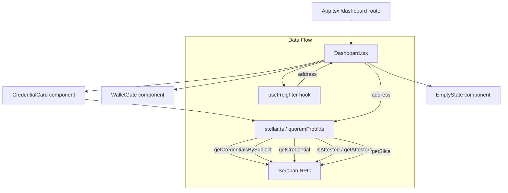
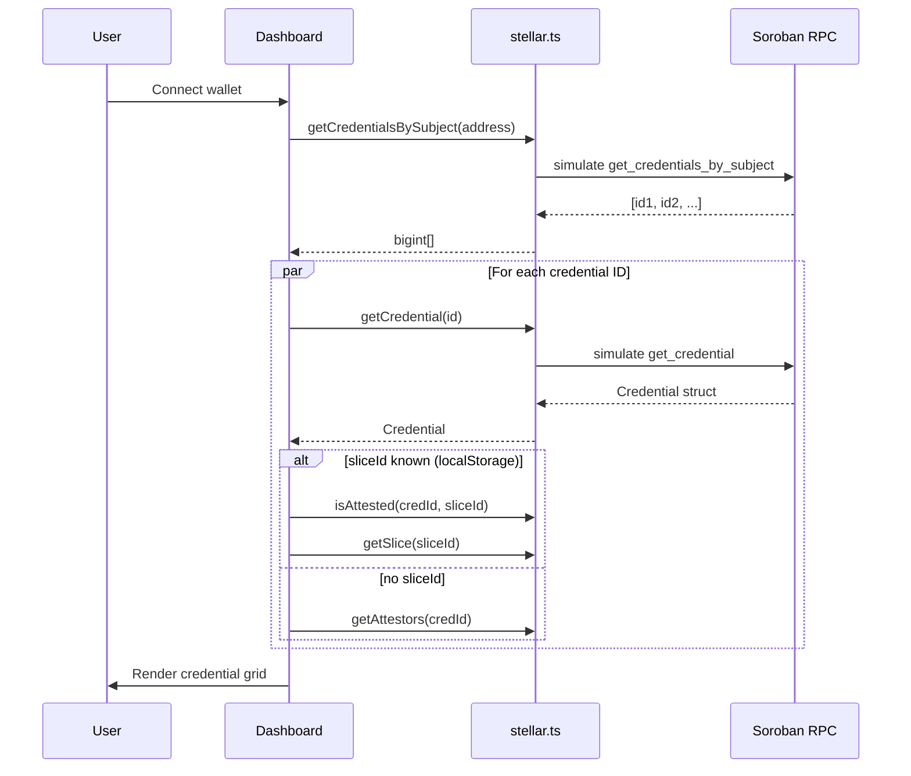

# Design Document: Credential Dashboard

## Overview

The Credential Dashboard is a wallet-gated React page at `/dashboard` that lets engineers view all on-chain verifiable credentials issued to their Stellar address. It surfaces three data domains per credential: the credential metadata, the attestation status, and the quorum slice composition (attestors + threshold).

The feature is built inside the existing `frontend/` React 19 + TypeScript application. It reuses the `useFreighter` wallet hook, the `quorumProof` typed contract client, and the existing routing in `App.tsx`. The existing `Dashboard.tsx` is a partial implementation that uses `getAttestors` as an attestation proxy and lacks `getSlice` support — this design replaces it with a complete implementation.

### Key Design Decisions

1. **`getSlice` added to `stellar.ts`**: The shared RPC module is the canonical place for read-only contract calls used by multiple pages. `getSlice` is added there (and re-exported from `quorumProof.ts` for typed access).

2. **Slice ID association strategy**: The `Credential` struct has no `slice_id` field. The dashboard uses a two-phase approach: first attempt `isAttested(credId, sliceId)` + `getSlice(sliceId)` when a slice ID is known (stored in `localStorage` under `qp-slice-id`, matching the vanilla JS prototype), and fall back to `getAttestors(credId).length > 0` as an attestation proxy when no slice ID is available.

3. **Existing `Dashboard.tsx` is replaced**: The current file is incomplete (missing `getSlice`, uses `getAttestors` only). The new implementation is a full rewrite that satisfies all requirements.

4. **Component decomposition**: Logic is split into `CredentialCard`, `EmptyState`, and `WalletGate` components to keep `Dashboard.tsx` focused on data fetching and layout orchestration.

5. **Role labels are UI-layer only**: The on-chain `QuorumSlice` has no role labels. The dashboard assigns them by attestor index using a fixed array (`['Lead Verifier', 'Co-Verifier', 'Auditor', 'Reviewer', 'Observer']`), matching the vanilla JS prototype.

---

## Architecture



### Data Fetching Strategy



---

## Components and Interfaces

### `Dashboard.tsx` (rewrite)

The top-level page component. Owns all async data fetching and renders the appropriate state (loading, error, empty, or credential grid).

```typescript
// State shape
interface CredCardData {
  credential: Credential;       // from quorumProof.ts
  attested: boolean;            // from isAttested or getAttestors fallback
  slice: QuorumSlice | null;    // from getSlice, null if unavailable
  expired: boolean;             // from isExpired
  sliceError: boolean;          // true if getSlice failed
  credError: string | null;     // per-card fetch error message
}
```

Responsibilities:
- Read `address` from `useFreighter`
- Read `sliceId` from `localStorage` (`qp-slice-id`)
- On `address` change: fetch all credential IDs, then fetch each card's data in parallel
- Render `WalletGate` when no address, loading spinner while fetching, error card on failure, `EmptyState` when zero credentials, or `dashboard-grid` of `CredentialCard`s

### `WalletGate.tsx`

Renders the wallet connection prompt. Shown when `address` is null and `isInitializing` is false.

Props:
```typescript
interface WalletGateProps {
  hasFreighter: boolean;
  connect: () => Promise<void>;
}
```

Renders:
- "Connect Wallet" button (calls `connect()`)
- If `!hasFreighter`: message + link to `https://freighter.app`

### `CredentialCard.tsx`

Renders a single credential's full summary. Receives pre-fetched data — no async calls inside.

Props:
```typescript
interface CredentialCardProps {
  data: CredCardData;
  sliceId: bigint | null;
}
```

Renders:
- Header: credential type label + status badge with `aria-label`
- Body: credential ID (truncated), issuer (truncated + `title`), metadata, expiry
- Quorum slice section: attestors list with role labels, threshold progress, or error/empty states
- Footer: "View Public Page →" link to `/verify?credentialId=<id>`

### `EmptyState.tsx`

Renders the empty state when a connected wallet has zero credentials.

Props:
```typescript
interface EmptyStateProps {
  address: string;
}
```

Renders:
- Icon + title + description
- Connected address display
- "Request Credential Issuance" CTA button

---

## Data Models

### On-chain types (from `quorumProof.ts`)

```typescript
interface Credential {
  id: bigint;
  subject: string;
  issuer: string;
  credential_type: number;
  metadata_hash: Uint8Array;
  revoked: boolean;
  expires_at: bigint | null;
}

interface QuorumSlice {
  id: bigint;
  creator: string;
  attestors: string[];
  threshold: number;
}
```

### `getSlice` — new function to add to `stellar.ts`

```typescript
/**
 * Retrieve a quorum slice by ID.
 * Returns the QuorumSlice struct: { id, creator, attestors, threshold }
 */
export async function getSlice(sliceId: bigint | number): Promise<QuorumSlice> {
  const sliceVal = nativeToScVal(BigInt(sliceId), { type: 'u64' });
  return simulate(CONTRACT_ID, 'get_slice', [sliceVal]);
}
```

This function must also be added to `quorumProof.ts` using the existing `simulate` helper and `u64` encoder already present in that file.

### Attestation Status Derivation

The `AttestationStatus` type is a UI-layer concept derived from on-chain data:

```typescript
type AttestationStatus = 'attested' | 'pending' | 'revoked' | 'expired';

function deriveStatus(
  revoked: boolean,
  expired: boolean,
  attested: boolean
): AttestationStatus {
  if (revoked) return 'revoked';
  if (expired) return 'expired';
  if (attested) return 'attested';
  return 'pending';
}
```

Priority order: `revoked` > `expired` > `attested` > `pending`.

### Address Truncation

```typescript
function formatAddress(addr: string): string {
  if (!addr || addr.length < 10) return addr || '—';
  return addr.slice(0, 8) + '…' + addr.slice(-6);
}
```

Full address is always available via `title` attribute on the element.

### Role Label Assignment

```typescript
const ATTESTOR_ROLES = ['Lead Verifier', 'Co-Verifier', 'Auditor', 'Reviewer', 'Observer'];

function attestorRole(index: number): string {
  return ATTESTOR_ROLES[index] ?? `Member ${index + 1}`;
}
```

### Credential Type Labels

```typescript
const CREDENTIAL_TYPES: Record<number, string> = {
  1: '🎓 Degree',
  2: '🏛️ License',
  3: '💼 Employment',
  4: '📜 Certification',
  5: '🔬 Research',
};
```

### localStorage Keys

| Key | Purpose |
|-----|---------|
| `qp-slice-id` | Optional global quorum slice ID used for `isAttested` + `getSlice` calls |

---


## Correctness Properties

*A property is a characteristic or behavior that should hold true across all valid executions of a system — essentially, a formal statement about what the system should do. Properties serve as the bridge between human-readable specifications and machine-verifiable correctness guarantees.*

### Property 1: Status Derivation Correctness

*For any* combination of `revoked` (boolean), `expired` (boolean), and `attested` (boolean) values, the `deriveStatus` function must return exactly one of `'revoked'`, `'expired'`, `'attested'`, or `'pending'`, and the priority order must be respected: `revoked` > `expired` > `attested` > `pending`. Specifically: if `revoked` is true the result is always `'revoked'` regardless of other inputs; if `revoked` is false and `expired` is true the result is always `'expired'`; if both are false and `attested` is true the result is `'attested'`; otherwise `'pending'`.

**Validates: Requirements 3.1, 3.2, 3.3, 3.4**

---

### Property 2: Card Count Matches Credential ID Count

*For any* non-empty list of credential IDs returned by `getCredentialsBySubject`, the number of `CredentialCard` elements rendered in the dashboard grid must equal the number of IDs in the list.

**Validates: Requirements 2.2**

---

### Property 3: Partial Failure Resilience

*For any* list of credential IDs where a subset of individual credential fetches fail, the dashboard must still render a `CredentialCard` for every successfully fetched credential, and the failed cards must show an inline error rather than crashing the entire grid.

**Validates: Requirements 2.5**

---

### Property 4: Credential Card Required Fields

*For any* `Credential` struct with a valid `credential_type`, `issuer`, `id`, and `metadata_hash`, the rendered `CredentialCard` must contain: the truncated credential ID (first 8 chars + `…` + last 6 chars of the string representation), the credential type label from `CREDENTIAL_TYPES`, the truncated issuer address, and — when `expires_at` is non-null — the formatted expiration date.

**Validates: Requirements 2.6, 2.7**

---

### Property 5: Attestor Address Truncation with Full Address on Hover

*For any* Stellar address string of length ≥ 10, the `formatAddress` function must return a string of the form `<first 8 chars>…<last 6 chars>`, and the corresponding DOM element must have a `title` attribute equal to the full untruncated address.

**Validates: Requirements 4.2**

---

### Property 6: Slice Section Renders Role Labels, Count, and Threshold

*For any* `QuorumSlice` with N attestors and threshold T, the rendered slice section must: display each attestor's address truncated via `formatAddress`, display the role label for each attestor at index i (from `ATTESTOR_ROLES[i]` or `Member ${i+1}` fallback), display the total attestor count N, and display the threshold value T.

**Validates: Requirements 4.3, 4.4**

---

### Property 7: Aria-Label Contains Attestation Status

*For any* `CredentialCard` rendered with a derived `AttestationStatus`, the element bearing the status badge must have an `aria-label` attribute that contains the status string (`'Attested'`, `'Pending'`, `'Revoked'`, or `'Expired'`).

**Validates: Requirements 3.5**

---

### Property 8: EmptyState Displays Connected Address

*For any* connected wallet address string, the `EmptyState` component must render that address visibly in its output so the engineer can confirm the correct wallet is connected.

**Validates: Requirements 5.4**

---

## Error Handling

### Top-Level Fetch Failure (Requirement 2.4)

If `getCredentialsBySubject` throws, the dashboard sets `error` state and renders an error card with the error message and a "Retry" button that re-triggers the fetch effect. The credential grid is not rendered.

### Per-Card Fetch Failure (Requirement 2.5)

Each credential's data is fetched in a `Promise.all` where individual failures are caught per-card. A failed card stores `credError: string` in its `CredCardData`. `CredentialCard` renders an inline error panel for that card while other cards render normally.

### `is_attested` Failure (Requirement 3.6)

If `isAttested(credId, sliceId)` throws, the error is caught, logged to `console.error`, and `attested` defaults to `false` (resulting in `'pending'` status). This prevents a single RPC failure from blocking the card render.

### `getSlice` Failure (Requirement 4.5)

If `getSlice(sliceId)` throws, `slice` is set to `null` and `sliceError` is set to `true`. The `CredentialCard` renders "Slice unavailable" in the slice section. All other credential data renders normally.

### Freighter Not Installed (Requirement 1.5)

`useFreighter` sets `hasFreighter: false` when the extension is not detected. `WalletGate` checks this flag and renders an install prompt with a link to `https://freighter.app` instead of the "Connect Wallet" button.

### No Slice ID Available

When `localStorage` has no `qp-slice-id`, `isAttested` cannot be called (it requires both `credentialId` and `sliceId`). The fallback is `getAttestors(credId)` — if the returned array is non-empty, `attested` is set to `true`. The slice section renders "No slice data available" since `getSlice` is not called.

---

## Testing Strategy

### Dual Testing Approach

Both unit tests and property-based tests are required. They are complementary:
- Unit tests cover specific examples, integration points, and edge cases
- Property tests verify universal correctness across all inputs

### Property-Based Testing Library

Use **fast-check** (`npm install --save-dev fast-check`), which is the standard PBT library for TypeScript/JavaScript.

Each property test must run a minimum of **100 iterations** (fast-check default is 100; set `{ numRuns: 100 }` explicitly).

Each property test must include a comment referencing the design property it validates:
```
// Feature: credential-dashboard, Property N: <property_text>
```

### Property Tests

Each correctness property from the design maps to exactly one property-based test:

**P1 — Status Derivation Correctness**
```typescript
// Feature: credential-dashboard, Property 1: Status derivation correctness
fc.assert(fc.property(
  fc.boolean(), fc.boolean(), fc.boolean(),
  (revoked, expired, attested) => {
    const status = deriveStatus(revoked, expired, attested);
    if (revoked) return status === 'revoked';
    if (expired) return status === 'expired';
    if (attested) return status === 'attested';
    return status === 'pending';
  }
), { numRuns: 100 });
```

**P2 — Card Count Matches Credential ID Count**
Generate a random array of bigint IDs, mock `getCredential` to resolve for each, render `Dashboard`, and assert the number of rendered `CredentialCard` elements equals the array length.

**P3 — Partial Failure Resilience**
Generate a random array of IDs where a random subset throws on `getCredential`. Assert that the number of successfully rendered cards equals the number of non-throwing IDs, and the failing cards show inline errors.

**P4 — Credential Card Required Fields**
Generate random `Credential` objects (varying `credential_type`, `issuer`, `id`, `expires_at`). Render `CredentialCard` and assert the truncated ID, type label, and truncated issuer are present. When `expires_at` is non-null, assert the expiry date is present.

**P5 — Attestor Address Truncation**
Generate random strings of length ≥ 10. Assert `formatAddress(s) === s.slice(0,8) + '…' + s.slice(-6)`. For the DOM test, generate random `QuorumSlice` objects and assert each attestor element has `title === fullAddress`.

**P6 — Slice Section Renders Role Labels, Count, Threshold**
Generate random `QuorumSlice` objects (varying attestor count and threshold). Render the slice section and assert: each attestor's truncated address appears, each role label appears, the count and threshold values appear.

**P7 — Aria-Label Contains Status**
Generate random `CredCardData` objects with random statuses. Render `CredentialCard` and assert the status badge element's `aria-label` contains the expected status string.

**P8 — EmptyState Displays Connected Address**
Generate random Stellar address strings. Render `EmptyState` with each address and assert the address string appears in the rendered output.

### Unit Tests

Unit tests focus on specific examples, integration points, and edge cases not covered by property tests:

- **WalletGate renders connect button** when `hasFreighter: true` (Req 1.2)
- **WalletGate renders install prompt + freighter.app link** when `hasFreighter: false` (Req 1.5)
- **Dashboard shows loading indicator** when `isInitializing: true` (Req 1.3)
- **Dashboard shows wallet gate** when `address: null, isInitializing: false` (Req 1.1)
- **Dashboard triggers fetch on address change** without page reload (Req 1.4)
- **Dashboard shows loading spinner** while fetching credentials (Req 2.3)
- **Dashboard shows error card with retry** when `getCredentialsBySubject` throws (Req 2.4)
- **EmptyState renders** when credential list is empty (Req 5.1)
- **EmptyState contains descriptive message** (Req 5.2)
- **EmptyState contains "Request Credential Issuance" CTA** (Req 5.3)
- **`getSlice` failure renders "Slice unavailable"** in slice section (Req 4.5)
- **Zero attestors renders "No attestors assigned"** (Req 4.6)
- **`is_attested` failure defaults to Pending** and logs to console (Req 3.6)
- **`getSlice` is called** when a sliceId is present in localStorage (Req 4.1)
- **`getCredentialsBySubject` is called** with the connected address (Req 2.1)

### Test File Locations

```
frontend/src/
  __tests__/
    deriveStatus.test.ts          # P1 property test
    formatAddress.test.ts         # P5 property test (pure function)
    CredentialCard.test.tsx       # P4, P6, P7 property tests + unit tests
    EmptyState.test.tsx           # P8 property test + unit tests
    Dashboard.test.tsx            # P2, P3 property tests + unit tests
    WalletGate.test.tsx           # unit tests
```
