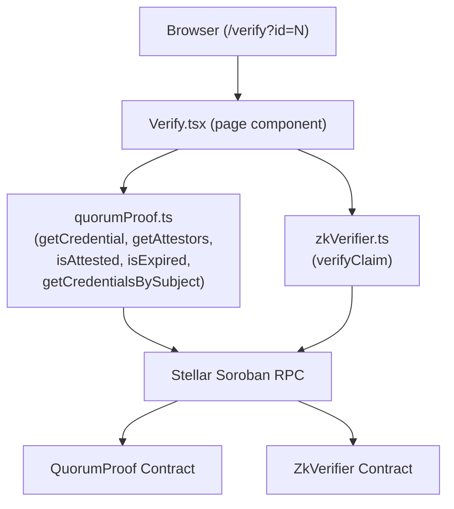

# Design Document: public-verify-page

## Overview

The public verification page (`/verify`) is a read-only React page that lets any third party
confirm the authenticity of an on-chain engineering credential without connecting a Stellar wallet.
This design closes five gaps in the existing `Verify.tsx` implementation:

1. Change the shareable URL query param from `?credentialId=` to `?id=`
2. Wire in the `is_attested` on-chain call (requires `credentialId` + `sliceId`)
3. Align the ZK claim dropdown to exactly the three on-chain `ClaimType` variants
4. Import and call `verifyClaim` from `zkVerifier.ts` (correct ScVal encoding)
5. Add a ZK privacy tooltip and show binary ✅ / ❌ result

All on-chain reads are performed via Soroban RPC simulation — no transaction signing, no wallet.

---

## Architecture



The page is purely presentational — it owns UI state and delegates all contract I/O to the two
typed clients. `stellar.ts` is no longer imported by `Verify.tsx`; the typed clients replace it.

---

## Components and Interfaces

### `Verify` (page root)

Owns all top-level state and orchestrates data fetching.

```ts
// State
activeTab: 'id' | 'addr'
credInput: string          // raw text in the credential-ID field
addrInput: string          // raw text in the address field
loading: boolean
error: string | null
result: VerifyResult | null
addrResults: bigint[] | null
autoTriggered: Ref<boolean>

// Derived from ?id= query param on mount
```

On mount, reads `?id=` (not `?credentialId=`) from `useSearchParams()` and auto-triggers
`fetchCred` if a valid positive integer is present.

When `fetchCred(id)` is called it:
1. Sets `loading = true`, clears `error` and `result`
2. Updates the URL to `?id={id}` via `setSearchParams({ id: id.toString() })`
3. Calls in parallel:
   - `getCredential(id)` from `quorumProof.ts`
   - `getAttestors(id)` from `quorumProof.ts`
   - `isExpired(id).catch(() => false)` from `quorumProof.ts`
   - `isAttested(id, DEFAULT_SLICE_ID).catch(() => null)` from `quorumProof.ts`
4. Sets `result` with all four values

### `CredentialResult`

Receives `{ credential, attestors, expired, attested }` and renders:
- Status banner (logic described in Requirement 4/5)
- Share bar with `?id=` URL
- Credential metadata card
- Attestors card
- ZK claim card (`ZkClaimPanel`)

### `ZkClaimPanel`

Isolated sub-component for the ZK form. Props: `credentialId: bigint`.

```ts
// State
claimType: ClaimType       // 'HasDegree' | 'HasLicense' | 'HasEmploymentHistory'
proofHex: string
zkResult: ZkResult | null  // { verified: boolean } | { error: string }
zkLoading: boolean
```

On submit:
1. Validates `proofHex` is non-empty
2. Calls `verifyClaim(credentialId, claimType, proofHex)` from `zkVerifier.ts`
3. Sets `zkResult` to `{ verified: true/false }` or `{ error: message }`

Renders the binary result banner and the ZK privacy tooltip (see UX spec below).

---

## Data Models

### `VerifyResult`

```ts
interface VerifyResult {
  credential: Credential;   // from quorumProof.ts
  attestors: string[];
  expired: boolean;
  attested: boolean | null; // null = is_attested call failed (treated as unconfirmed)
}
```

### `ZkResult`

```ts
type ZkResult =
  | { kind: 'verified'; value: boolean }
  | { kind: 'error'; message: string };
```

### `ClaimType` (re-exported from `zkVerifier.ts`)

```ts
type ClaimType = 'HasDegree' | 'HasLicense' | 'HasEmploymentHistory';
```

The dropdown maps these to display labels:
- `HasDegree` → "🎓 Degree"
- `HasLicense` → "🏛️ License"
- `HasEmploymentHistory` → "💼 Employment History"

---

## Key Design Decisions

### `is_attested` sliceId strategy

The `is_attested(credential_id, slice_id)` contract method requires a `sliceId`. The Verify page
has no prior knowledge of which slice was used to attest a given credential.

**Decision: use `sliceId = 1n` as the default convention.**

Rationale:
- The QuorumProof contract auto-increments slice IDs starting at 1. In the typical deployment
  workflow a single canonical slice (ID 1) is created and used for all credential attestations.
- Calling `get_attestors(credentialId)` already gives the raw attestor list for display purposes.
  `is_attested` adds the quorum-threshold check on top of that.
- If `is_attested(id, 1n)` throws (e.g. slice 1 does not exist), the page catches the error,
  sets `attested = null`, and shows an "Attestation status unconfirmed" warning — it does not crash.
- This is a pragmatic default for v1. A future enhancement could expose a `?sliceId=` query param
  or derive the slice from an off-chain index.

```ts
const DEFAULT_SLICE_ID = 1n;
```

### Import migration

`Verify.tsx` currently imports everything from `../stellar`. After this change:

- `getCredential`, `getAttestors`, `isExpired`, `getCredentialsBySubject` → imported from `../lib/contracts/quorumProof`
- `isAttested` (new) → imported from `../lib/contracts/quorumProof`
- `verifyClaim` → imported from `../lib/contracts/zkVerifier`
- `decodeMetadataHash`, `CONTRACT_ID`, `RPC_URL`, `NETWORK` → still imported from `../stellar` (these are utilities/constants not yet in the typed clients)

This is a targeted migration: only the functions with correctness implications are moved. The
display-only utilities stay in `stellar.ts` to minimise diff scope.

### ZK privacy tooltip UX

When a ZK result is shown (either verified or not verified), a ℹ️ icon appears inline next to
the result banner. The icon has a `title` attribute containing the explanation text, and an
`aria-label` for screen readers. On hover/focus the browser native tooltip appears.

```
✅ Claim Verified  ℹ️
```

Tooltip text:
> "Zero-knowledge proofs confirm a property of a credential (e.g. holds a degree) without
> revealing the credential data itself. The proof is verified entirely on-chain."

This is the simplest approach that requires no additional CSS and works across all browsers.
A collapsible panel would be richer but is out of scope for this change.

---

## Correctness Properties

*A property is a characteristic or behavior that should hold true across all valid executions of
a system — essentially, a formal statement about what the system should do. Properties serve as
the bridge between human-readable specifications and machine-verifiable correctness guarantees.*

### Property 1: Share URL round-trip

*For any* valid positive-integer credential ID `n`, the Share_URL generated when credential `n`
is displayed SHALL be `/verify?id=n`, and loading that URL SHALL produce the same displayed
credential as manually entering `n` in the ID input and submitting.

**Validates: Requirements 6.1, 6.3, 6.4**

### Property 2: ClaimType dropdown exhaustiveness

*For any* render of the ZK claim dropdown, the set of `<option>` values SHALL be exactly
`{ "HasDegree", "HasLicense", "HasEmploymentHistory" }` — no more, no fewer.

**Validates: Requirements 7.2, 7.3, 8.3**

### Property 3: ClaimType encoding invariant

*For any* ClaimType value `c` in `{ "HasDegree", "HasLicense", "HasEmploymentHistory" }`,
the ScVal produced by `claimTypeToScVal(c)` in `zkVerifier.ts` SHALL equal
`scvVec([scvSymbol(c)])`. Calling `verifyClaim` with `c` SHALL use this encoding and not a
plain string ScVal.

**Validates: Requirements 8.1, 8.4**

### Property 4: ZK result banner determinism

*For any* call to `verifyClaim` that returns `true`, the page SHALL display "✅ Claim Verified".
*For any* call that returns `false`, the page SHALL display "❌ Claim Not Verified".
The displayed text SHALL be a pure function of the boolean return value.

**Validates: Requirements 7.6, 7.7**

### Property 5: Empty proof rejection

*For any* string composed entirely of whitespace or the empty string, submitting it as the ZK
proof SHALL be rejected client-side with a validation error, and `verifyClaim` SHALL NOT be
called.

**Validates: Requirements 7.9**

### Property 6: Status banner determinism

*For any* `VerifyResult`, the status banner class and title SHALL be a pure function of
`(credential.revoked, expired, attested, attestors.length)` according to the priority order:
revoked > expired > attested=true > attestors>0 > awaiting.

**Validates: Requirements 5.2, 5.3, 5.4, 5.5, 4.2, 4.3**

### Property 7: Input validation — no on-chain call on bad input

*For any* credential ID input that is zero, negative, non-numeric, or empty, submitting the
form SHALL display a validation error and SHALL NOT invoke `getCredential` or any other
on-chain simulation.

*For any* address input that does not start with `G` or is shorter than 56 characters,
submitting the form SHALL display a validation error and SHALL NOT invoke
`getCredentialsBySubject`.

**Validates: Requirements 2.3, 3.5**

---

## Error Handling

| Scenario | Behaviour |
|---|---|
| `get_credential` throws | Show error card; do not crash |
| `is_attested` throws | Set `attested = null`; show "Attestation status unconfirmed" warning in status banner |
| `get_attestors` throws | Treat as empty list; show warning |
| `is_expired` throws | Treat as `false` (not expired) |
| `verifyClaim` throws | Show error message in ZK result area |
| `VITE_CONTRACT_QUORUM_PROOF` not set | Show red badge "⚠ Contract not configured"; do not crash |
| `VITE_CONTRACT_ZK_VERIFIER` not set | `verifyClaim` throws; caught and shown as ZK error |
| Invalid `?id=` query param | Show validation error; do not make on-chain call |

All async calls are wrapped in `try/catch`. Loading state is always cleared in `finally`.
A new search always clears the previous error before initiating the lookup.

---

## Testing Strategy

### Unit tests (Vitest)

Focus on pure functions and specific examples:

- `credTypeLabel` maps known numbers to expected strings
- `formatTimestamp` formats known timestamps correctly
- `formatAddress` truncates addresses correctly
- Status banner logic: given specific `(revoked, expired, attested, attestors)` tuples, assert
  the correct `statusClass` and `statusTitle`
- Validation: `credInput = "0"` → error, `credInput = "-1"` → error, `credInput = "abc"` → error
- Address validation: `"GABC"` (too short) → error, `"Xabc..."` (wrong prefix) → error
- ZK result rendering: `verifyClaim` mock returns `true` → "✅ Claim Verified" in DOM;
  returns `false` → "❌ Claim Not Verified" in DOM
- Share URL: after `fetchCred(42n)`, `window.location.search` contains `?id=42`

### Property-based tests (fast-check, minimum 100 iterations each)

Use `fast-check` for TypeScript property-based testing.

Each test is tagged with a comment referencing the design property it validates.

**Property 1 — Share URL round-trip**
```
// Feature: public-verify-page, Property 1: Share URL round-trip
fc.property(fc.bigInt({ min: 1n, max: 9_999_999n }), (id) => {
  const url = buildShareUrl(id);
  const parsed = parseIdFromUrl(url);
  return parsed === id;
})
```

**Property 2 — ClaimType dropdown exhaustiveness**
```
// Feature: public-verify-page, Property 2: ClaimType dropdown exhaustiveness
// Example-based (fixed set): render ZkClaimPanel, collect all option values,
// assert deep-equal to ['HasDegree', 'HasLicense', 'HasEmploymentHistory']
```

**Property 3 — ClaimType encoding invariant**
```
// Feature: public-verify-page, Property 3: ClaimType encoding invariant
fc.property(fc.constantFrom('HasDegree', 'HasLicense', 'HasEmploymentHistory'), (c) => {
  const scval = claimTypeToScVal(c);
  // scval must be scvVec containing exactly one scvSymbol equal to c
  return scval.switch() === xdr.ScValType.scvVec() &&
         scval.vec()[0].switch() === xdr.ScValType.scvSymbol() &&
         scval.vec()[0].sym().toString() === c;
})
```

**Property 4 — ZK result banner determinism**
```
// Feature: public-verify-page, Property 4: ZK result banner determinism
fc.property(fc.boolean(), (verified) => {
  // render ZkClaimPanel with mocked verifyClaim returning `verified`
  // assert banner text === (verified ? '✅ Claim Verified' : '❌ Claim Not Verified')
})
```

**Property 5 — Empty proof rejection**
```
// Feature: public-verify-page, Property 5: Empty proof rejection
fc.property(fc.stringOf(fc.constantFrom(' ', '\t', '\n')), (whitespace) => {
  // submit ZK form with whitespace-only proof
  // assert verifyClaim was NOT called and error message is shown
})
```

**Property 6 — Status banner determinism**
```
// Feature: public-verify-page, Property 6: Status banner determinism
fc.property(
  fc.record({
    revoked: fc.boolean(),
    expired: fc.boolean(),
    attested: fc.option(fc.boolean()),
    attestorCount: fc.nat(),
  }),
  ({ revoked, expired, attested, attestorCount }) => {
    const { statusClass } = deriveStatus(revoked, expired, attested, attestorCount);
    if (revoked) return statusClass === 'revoked';
    if (expired) return statusClass === 'expired';
    if (attested === true) return statusClass === 'valid';
    if (attestorCount > 0) return statusClass === 'valid';
    return statusClass === 'pending';
  }
)
```

**Property 7 — Input validation guards**
```
// Feature: public-verify-page, Property 7: Input validation — no on-chain call on bad input
fc.property(
  fc.oneof(
    fc.constant('0'), fc.constant('-1'), fc.constant('abc'),
    fc.integer({ max: 0 }).map(String)
  ),
  (badId) => {
    // submit credential ID form with badId
    // assert getCredential mock was NOT called
  }
)
```

Both unit and property tests live in `frontend/src/pages/__tests__/Verify.test.tsx`.
Property tests use `@fast-check/vitest` integration for clean `test.prop(...)` syntax.
Each property test runs a minimum of 100 iterations (fast-check default is 100).
